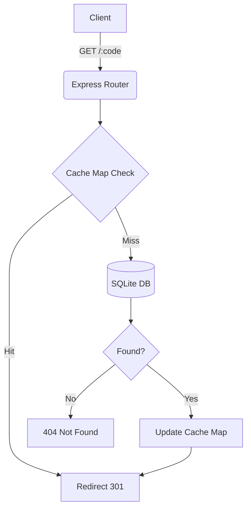

<div align="center">
  

  <br />
  <br />

  <p>
    <b>A production-ready URL shortener with a beautiful premium UI, built with Node.js, Express, and SQLite.</b>
  </p>

  <p>
    
    
    
    
  </p>
</div>

---

## ✨ Features

- 🔗 **Shorten URLs** — Generates unique 6-character short codes using `nanoid`.
- 🎨 **Stunning Frontend** — Glassmorphism UI, real-time stats, and recent links saved in local storage.
- ⚡ **Fast Redirects** — In-memory cache-aside pattern for sub-millisecond redirect lookups.
- 📊 **Click Analytics** — Tracks click count per short URL.
- 📦 **Zero Config Database** — Uses SQLite (`sql.js`) with an auto-creating database file.
- 🛡️ **Collision Handling** — Retries up to 3 times gracefully on hash collision.

---

## 🛠️ Tech Stack

| Component | Technology | Purpose |
| :--- | :--- | :--- |
| **Frontend** | HTML / CSS / JS | Premium UI with animated particles & responsive design |
| **Runtime** | Node.js v24+ | Fast JavaScript runtime environment |
| **Framework** | Express.js | robust HTTP routing & static file serving |
| **Database** | SQLite (`sql.js`) | Persistent URL storage (zero native compilation) |
| **Cache** | In-Memory Map | High-speed redirect lookups with TTL expiration |
| **ID Gen** | nanoid v3 | URL-safe and collision-resistant short code generation |

---

## 🧠 Architecture

### Request Lifecycle



### Caching Strategy (Cache-Aside)
- **On `POST /shorten`**: Insert to DB only — don't cache (many URLs never get visited).
- **On `GET /:code`**: Check Cache → miss → query DB → cache result → redirect.
- **On `DELETE /api/:code`**: Remove from DB + invalidate Cache.
- **TTL**: 24 hours (configurable via `CACHE_TTL`).

---

## 🚀 Quick Start

### Prerequisites
- [Node.js](https://nodejs.org/) installed on your machine.

### Setup

```bash
# 1. Install dependencies
npm install

# 2. Configure environment (optional)
cp .env.example .env

# 3. Start the server (auto-creates database in /data)
npm run dev
```

Then open [**http://localhost:3000**](http://localhost:3000) in your browser.

---

## 📖 API Reference

### `POST /api/shorten`
Shorten a long URL.

```bash
curl -X POST http://localhost:3000/api/shorten \
  -H "Content-Type: application/json" \
  -d '{"url": "https://www.google.com"}'
```

**Response (201):**
```json
{
  "success": true,
  "short_url": "http://localhost:3000/aB3xKp",
  "code": "aB3xKp"
}
```

### `GET /:code`
Redirects to the original URL (HTTP 301).

### `GET /api/stats/:code`
Get click statistics for a short URL.

**Response (200):**
```json
{
  "success": true,
  "data": {
    "code": "aB3xKp",
    "long_url": "https://www.google.com",
    "clicks": 42,
    "created_at": "2024-01-15T10:30:00.000Z"
  }
}
```

### `DELETE /api/:code`
Delete a short URL and invalidate its cache. Returns `204 No Content`.

### `GET /health`
Health check endpoint to ensure service uptime.

---

## 📐 Design Decisions

| Decision | Rationale |
| :--- | :--- |
| **In-memory Cache** | Reads outnumber writes 100:1; answers in <1ms vs DB queries. |
| **Cache-aside** *(not write-through)* | Only cache on first GET — avoids caching URLs that are never visited. |
| **Non-fatal Cache failures** | Cache is a performance layer, not source of truth; app degrades gracefully. |
| **HTTP 301 redirect** | Browsers cache 301 locally — subsequent visits skip the server entirely. |
| **nanoid(6) with retry** | 56 billion possible codes; collision retry handles the astronomically rare case. |
| **Fire-and-forget click increment**| Don't block the redirect response to update the click count. |

---

## ☁️ Deployment Note (Render)

If deploying to [Render.com](https://render.com)'s free tier, note that they use **ephemeral file systems**. This means the `data/urlshortener.db` SQLite file will be wiped every time the server goes to sleep or redeploys. 

For a production deployment, either:
1. Attach a **Render Persistent Disk** (paid).
2. Swap the database driver from `sql.js` back to `pg` (PostgreSQL) and use a free hosted database like Supabase or Neon. The architecture patterns remain identical.

---

<div align="center">
  <p><strong>Created by Atharva Futane</strong></p>
</div>
